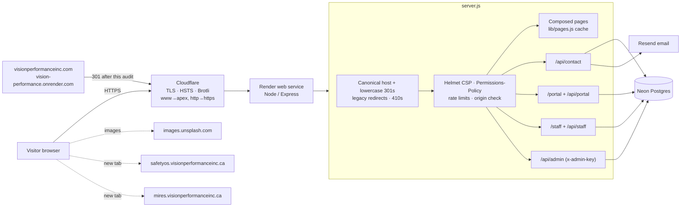

# 00: System discovery

## What the system is

`visionperformanceinc.ca` is a server-composed marketing site. It also hosts two small authenticated apps: a client portal and a staff enquiry dashboard.

| Layer | Technology |
|---|---|
| Runtime | Node.js (≥18; audited on 24.16), Express 4.22 |
| Pages | `views/pages/**.html` with `<!--meta {…}-->` front matter, composed at boot by `lib/pages.js` (partials, dynamic partials, global tokens, JSON-LD, nav state, external-link post-processing). Cached in memory |
| Assets | `public/assets/{css,js,img,fonts}`, one stylesheet (47 KB) and one script (14 KB), no build step, content-hashed `?v=` query, `immutable` 1 year |
| Data | Neon Postgres (`enquiries`, portal tables) via `pg`; `lib/db.js` stubs the pool when `DATABASE_URL` is unset |
| Email | Resend; logs to the console when not configured |
| Hosting | Render web service (`render.yaml`), auto-deploy from `main` |
| Edge | Cloudflare: DNS, TLS, HSTS, Brotli, HTTP→HTTPS and `www`→apex redirects |
| Images | Brand derivatives self-hosted; photographs from `images.unsplash.com` (metadata in `views/data/photos.js`) |
| Tests | `node:test` suite (`npm test`, 55 tests) and Playwright E2E (`npm run test:e2e`, 9 journeys) |

## Architecture



## Repository map (after the audit)

```
server.js            Express app (exported for tests; listens only when run directly)
lib/                 pages.js (composer), dynamic-partials.js, auth.js, db.js, mailer.js, schema.sql
routes/              contact.js, portal.js, staff.js, admin.js
views/               layout.html, partials/, pages/ (25 routes + 404 + 500), data/
public/              assets/, portal.*, staff.*, robots.txt, images/logo-nav.png (portal)
brand/               full-size logo and render masters (not served)
scripts/             optimize-images.js, audit/crawl.js
test/                site.test.js, e2e/journeys.e2e.js
docs/                website-refresh/ (redesign record), audit/ (this audit)
archive/legacy-spa/  the previous single-page site, kept for reference (see F-07)
```

## Owner decisions in force

These decisions came from earlier sessions and constrain what the audit may publish:

- Mobile clinics are *planned*.
- There are no licensed clinicians yet.
- The shop is now a safety-eyewear style picker, not a store.
- Testimonials, pricing, the ROI calculator and sustainability claims are removed.
- The phone number is kept but unconfirmed.
- Photographs only, no decorative SVG.
- The main wordmark is used for the favicon and share image.
- No image-library credit is shown on the site.
- External links open in a new tab.
